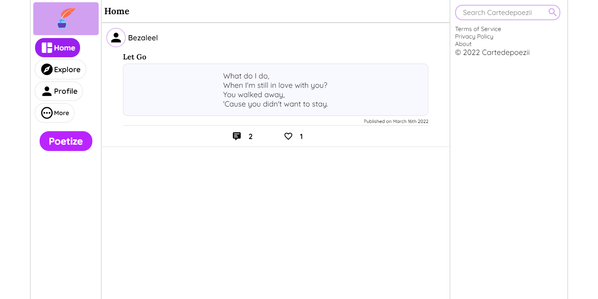
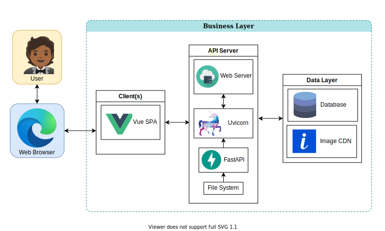

# Cartedepoezii

## Introduction

Cartedepoezii is a social platform for poem writers and readers. The name _Cartedepoezii_ was formed from the Romanian translation of the phrase "poem book". The project was inspired by my love for poems and my interest in the design and functioning of a social platform.
+ Visit [Cartedepoezii](https://cartedepoezii.netlify.app/).
+ Connect with me on [LinkedIn](https://www.linkedin.com/in/bezaleel-olakunori-34335513a/).
+ See the article I wrote about this project on [Medium](https://medium.com/@bezaleelolakunori/the-cartedepoezii-platform-ba86abd3ba04).

## How It Works

This project is made up of multiple projects that include the API server and the web client. Data is stored in a PostgreSQL database, which can be remote or local to the API server. Images are stored using ImageKit.io's CDN. The web client is built using Vue with TypeScript and the API server is built using FastAPI. The web client makes requests to the API server and fetches images from ImageKit.io's CDN. The web client is the main interface for accessing Cartedepoezii. The image below summarizes the project's data flow.

## Installation

+ Visit [FastAPI API server](backend/) and [Vue SPA](web_client/) for installation instructions.

## Usage

To use this project, visit [Vue SPA](web_client/) and [FastAPI API server](backend/) for usage instructions. It would be preferred if you start [FastAPI API server](backend/) first since [Vue SPA](web_client/) depends on it.

## Contributing

We welcome any contributions but please read our [CONTRIBUTING](./CONTRIBUTING.md) guidelines before you make any.

## Discussion

+ Discuss Cartedepoezii on [GitHub Discussions](https://github.com/B3zaleel/Cartedepoezii/discussions)

## Related Projects

+ [FastAPI API server](backend/)
+ [Vue SPA](web_client/)

## Licensing

Cartedepoezii is licensed under the [MIT LICENSE](LICENSE).
