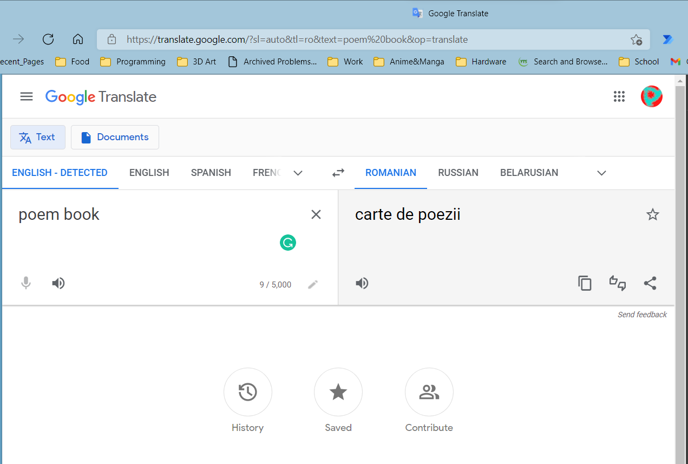

# Cartedepoezii

<!--  -->
**Cartedepoezii** is a social platform for poem writers and readers.

## Team

We are taking a holistic approach to the development and management of the project, whereby we are all involved in all aspects of the development and management of the portfolio project. However, we have assigned ourselves to spearhead each of the development processes.
+ Bezaleel Olakunori - Backend Development
  + Bezaleel is spearheading the backend development because he has in-depth experience in the technology we’ll utilize at the backend.
+ Celestine Akpanoko - Documentation Writing and App Testing
  + Celestine is spearheading the testing and documentation responsibility regardless of the effort he will put into the frontend and backend of things.
+ Godslove Udo - Frontend Development
  + Godslove will be in charge of the frontend development because of his experience in the aesthetic designs of applications.

## Technologies

1. React (possibly with SSR).
2. FastAPI. The other option we considered was Django but Django is a solution that we thought was bloated and contained a lot of features we wouldn't really need.
3. PostgreSQL (with SQLAlchemy). An alternative to PostgreSQL is MongoDB, which allows for horizontal scalability but isn't ACID compliant.
4. HTML5
5. CSS3
6. JavaScript
7. Python3

## Challenge

Poetry is a type of literature that describes a scene, tells a story, or conveys a thought in a concentrated and rhythmic arrangement of words. Poets worldwide find difficulty sometimes with sharing their craft with the world. The utilization of web-based application for reading and writing poems can address this challenge. However, some websites enable poets and poem readers to write and read poems but they lack some important features for a specialized poem websites.

The project aims to provide a modern and lively social platform for primarily sharing poems and would not be a platform for sharing diverse content like the major social media platforms (Facebook, Instagram, and Twitter) do. The project aims to be an exciting platform for people to consume all kinds of poetry. It is not limited to a specific locale, so you would be able to share haiku or your poems on the platform.

## Risks

We plan to use GraphQL with FastAPI, which is a technology we haven't worked with before. If things go south we could fall back to a REST API.

The non-technical risks include copyright/piracy issues arising from the content being allowed to spread on the platform.

## Infrastructure

We would perform a trunk-based development in this project. The frontend and backend servers would be deployed on Heroku. The platform’s data would be populated by users that sign up and publish poems or respond to poems on the platform. For API tests, we would use Python's unittest module.

## Existing Solutions

Several solutions exist but most of them are either outdated or not focused on poems. Two of such solutions are [All Poetry](https://allpoetry.com/) and [Poetry Soup](https://www.poetrysoup.com/), which appear to be outdated or contain styles that don’t look modern even though they’re focused on poems just like our platform. Two other solutions are [Twitter](https://twitter.com/) and [Medium](https://medium.com/) and although they look modern, their focus isn’t on poems.
