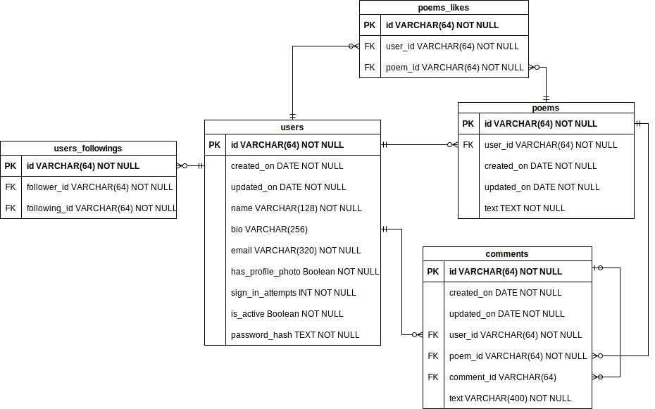
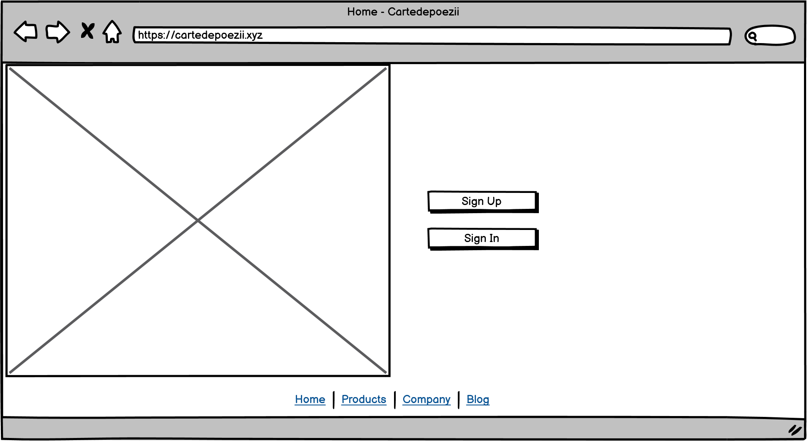
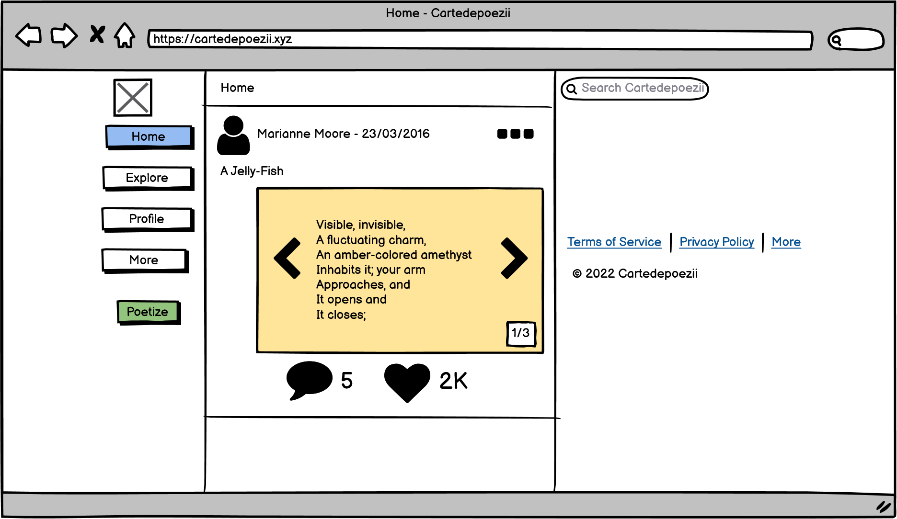
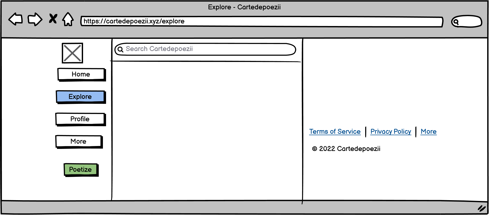
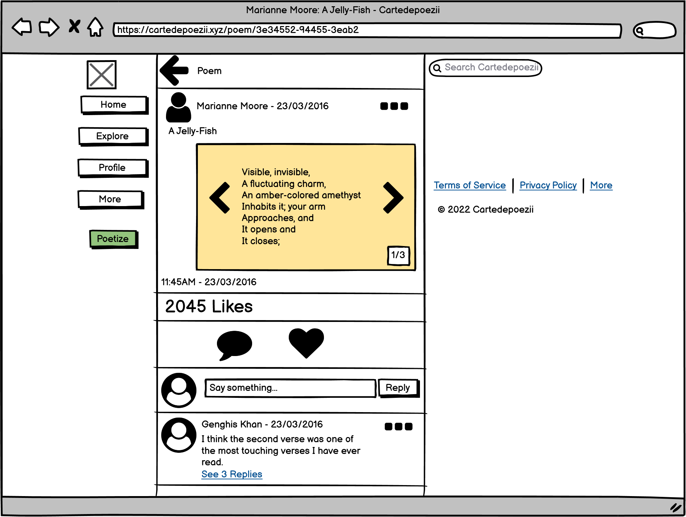
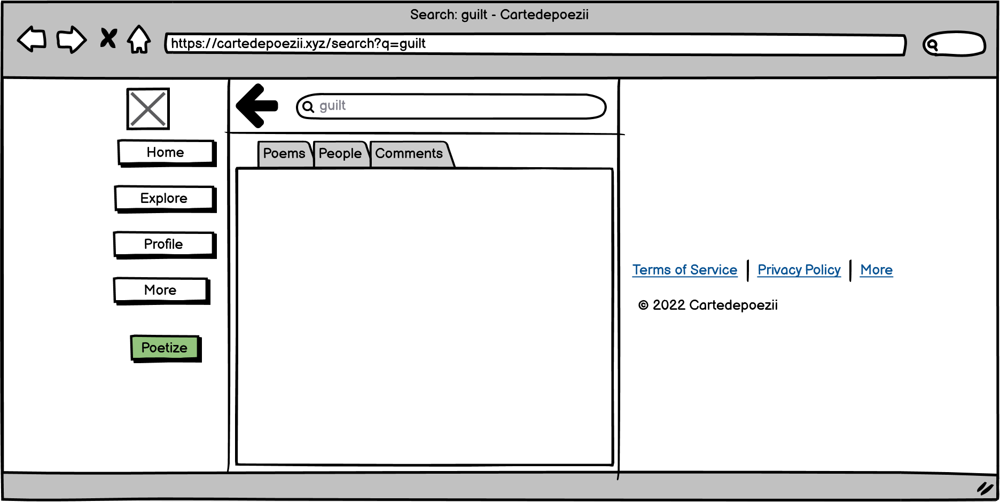
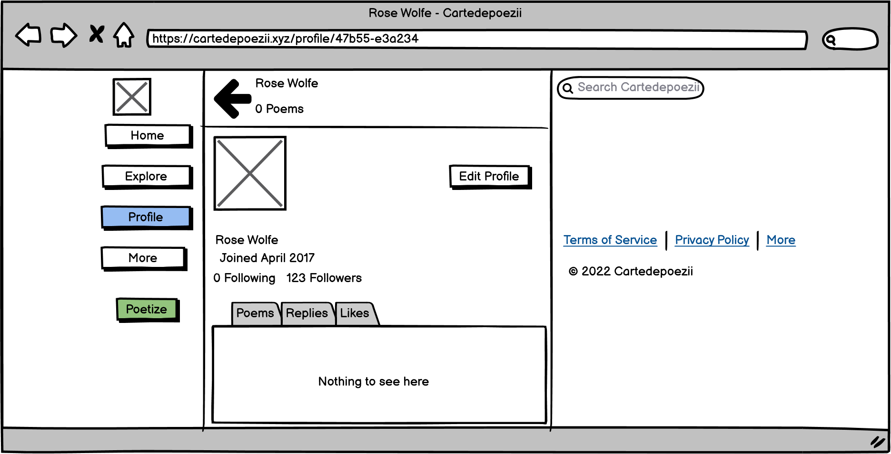

# MVP Specification

## Architecture


## APIs and Methods

The API routes described below are some of the endpoints that can be accessed on the web server. Any client can use the endpoints but some endpoints for user information require the user to be authenticated.

```yaml
BASE_URL: https://{{hostname}}/api/v1
```

+ Authentication:
  + **POST** `{BASE_URL}/sign-in`<br/>Sign in a user.
  + **POST** `{BASE_URL}/sign-up`<br/>Create a new user.

+ User:
  + **GET** `{BASE_URL}/user?username`<br/>Retrieve info about a user.
  + **PUT** `{BASE_URL}/user`<br/>Update info about a user.
  + **DELETE** `{BASE_URL}/user`<br/>Remove a user.

+ Connection:
  + **GET** `{BASE_URL}/following`<br/>Get the usernames of a user's followings.
  + **GET** `{BASE_URL}/followers`<br/>Get the usernames of a user's followers.
  + **PUT** `{BASE_URL}/follow`<br/>Toggle the followership (follow or not follow) between 2 users.

+ Poem:
  + **GET** `{BASE_URL}/poem?id`<br/>Retrieve a poem.
  + **POST** `{BASE_URL}/poem`<br/>Create a new poem.
  + **PUT** `{BASE_URL}/poem`<br/>Update a poem.
  + **DELETE** `{BASE_URL}/poem`<br/>Delete a poem.
  + **PUT** `{BASE_URL}/poem/like`<br/>React to (like or unlike) a poem.
  + **GET** `{BASE_URL}/poem/replies`<br/>Retrieve replies to a poem.
  + **POST** `{BASE_URL}/poem/reply`<br/>Reply to a poem.
  + **DELETE** `{BASE_URL}/poem/reply`<br/>Remove reply to a poem.

### 3rd Party APIs

+ [Imagekit.io](http://imagekit.io/)

## Data Model



## User Stories

+ As a poem writer, I can post a poem so that my audience can consume it.
+ As a poem reader, I would like to subscribe to my favourite poem writers so that I can stay up-to-date with their latest poem posts.
+ As a poem reader, the ability to react to a poem post by commenting or liking so that I can express my interest in a poem (or its author) is dear to me.

## Mockups







